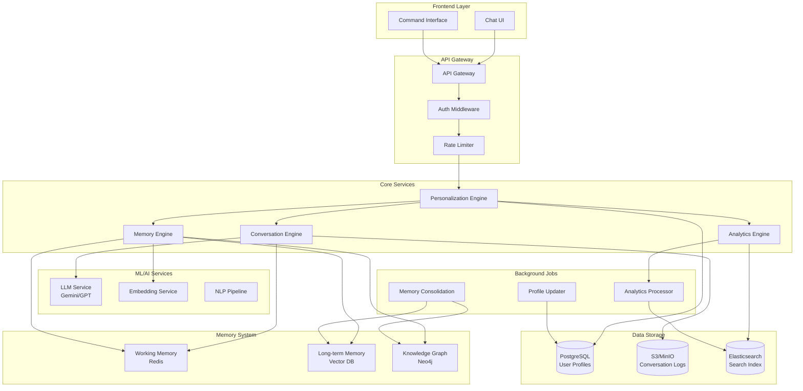

# AI Chat Personalization Architecture

## Overview

This document outlines the architecture for a robust and scalable personalization system for the AI Chat application. The system is designed to provide deeply personalized conversation experiences through intelligent memory management and adaptive response generation.

## System Architecture



## Component Details

### 1. API Gateway
- **Purpose**: Single entry point for all client requests
- **Responsibilities**:
  - Request routing
  - Authentication/Authorization
  - Rate limiting
  - Request/Response transformation
  - API versioning

### 2. Personalization Engine
- **Purpose**: Central orchestrator for personalized experiences
- **Key Features**:
  - Dynamic user profile management
  - Context-aware response generation
  - Preference learning and adaptation
  - Relationship level tracking

### 3. Memory Engine
- **Purpose**: Intelligent memory management system
- **Components**:
  - **Working Memory (Redis)**:
    - Current session context
    - Recent interactions (last 24 hours)
    - Active conversation threads
    - Real-time entity tracking
  
  - **Long-term Memory (Vector DB)**:
    - Episodic memories with embeddings
    - Semantic search capabilities
    - Temporal decay implementation
    - Importance-based retention
  
  - **Knowledge Graph (Neo4j)**:
    - User facts and relationships
    - Entity connections
    - Concept hierarchies
    - Inference capabilities

### 4. Conversation Engine
- **Purpose**: Manages conversation flow and response generation
- **Features**:
  - Context window optimization
  - Dynamic prompt construction
  - Response consistency checking
  - Multi-turn conversation handling

### 5. Analytics Engine
- **Purpose**: Tracks and analyzes user interactions
- **Capabilities**:
  - Sentiment analysis over time
  - Topic trend identification
  - Engagement metrics
  - Behavioral pattern recognition

## Data Models

### User Profile Schema
```typescript
interface UserProfile {
  userId: string;
  metadata: {
    createdAt: Date;
    updatedAt: Date;
    lastActiveAt: Date;
    relationshipLevel: 'new' | 'familiar' | 'friend' | 'collaborator';
    trustScore: number; // 0-1
  };
  
  identity: {
    confirmedInfo: {
      name?: string;
      occupation?: string;
      location?: string;
      [key: string]: any;
    };
    inferredInfo: {
      [key: string]: {
        value: any;
        confidence: number; // 0-1
        source: string; // conversation ID
        timestamp: Date;
      };
    };
  };
  
  preferences: {
    communication: {
      responseLength: 'brief' | 'moderate' | 'detailed' | 'adaptive';
      formality: number; // 0-1
      emotionalTone: number; // 0-1
      humor: number; // 0-1
      technicalDepth: number; // 0-1
    };
    
    topics: {
      interests: Array<{
        topic: string;
        score: number; // 0-1
        lastMentioned: Date;
        mentionCount: number;
      }>;
      avoidTopics: string[];
    };
  };
  
  personality: {
    traits: {
      openness: number; // 0-1
      conscientiousness: number; // 0-1
      extraversion: number; // 0-1
      agreeableness: number; // 0-1
      emotionalStability: number; // 0-1
    };
    
    communicationStyle: {
      assertiveness: number; // 0-1
      analyticalThinking: number; // 0-1
      creativity: number; // 0-1
      empathy: number; // 0-1
    };
  };
  
  statistics: {
    totalInteractions: number;
    averageResponseTime: number;
    preferredInteractionTimes: number[]; // hours of day
    sentimentTrend: Array<{
      date: Date;
      sentiment: number; // -1 to 1
    }>;
  };
}
```

### Memory Entry Schema
```typescript
interface MemoryEntry {
  id: string;
  userId: string;
  type: 'episodic' | 'semantic' | 'procedural';
  
  content: {
    raw: string;
    summary: string;
    entities: Array<{
      text: string;
      type: 'person' | 'place' | 'organization' | 'event' | 'concept';
      salience: number; // 0-1
    }>;
    embedding: number[];
  };
  
  metadata: {
    timestamp: Date;
    conversationId: string;
    importance: number; // 0-1
    emotionalValence: number; // -1 to 1
    accessCount: number;
    lastAccessedAt: Date;
    decayFactor: number; // 0-1
  };
  
  context: {
    precedingMessages: string[];
    followingMessages: string[];
    topic: string;
    intent: string;
  };
  
  relationships: {
    relatedMemories: string[];
    contradicts?: string[];
    supports?: string[];
  };
}
```

## API Endpoints

### Memory Management
- `GET /api/v1/memory/search` - Search memories with semantic similarity
- `GET /api/v1/memory/timeline` - Get memories in chronological order
- `POST /api/v1/memory/feedback` - User feedback on memory relevance
- `DELETE /api/v1/memory/{id}` - Delete specific memory
- `PUT /api/v1/memory/{id}` - Update memory content

### Profile Management
- `GET /api/v1/profile` - Get user profile
- `PUT /api/v1/profile` - Update profile information
- `GET /api/v1/profile/export` - Export all user data
- `DELETE /api/v1/profile` - Delete all user data

### Conversation
- `POST /api/v1/chat` - Send message and receive response
- `GET /api/v1/chat/context` - Get current conversation context
- `POST /api/v1/chat/feedback` - Provide feedback on response

## Implementation Phases

### Phase 1: Core Infrastructure
1. Set up project structure and dependencies
2. Implement basic API Gateway
3. Create data models and database schemas
4. Set up Redis for working memory
5. Implement basic authentication

### Phase 2: Memory System
1. Integrate vector database (Chroma/Pinecone)
2. Implement embedding generation
3. Create memory storage and retrieval logic
4. Implement temporal decay algorithm
5. Build memory consolidation service

### Phase 3: Personalization Engine
1. Implement user profile management
2. Create preference learning algorithms
3. Build dynamic prompt construction
4. Implement relationship level tracking
5. Create response adaptation logic

### Phase 4: Advanced Features
1. Implement knowledge graph with Neo4j
2. Build predictive suggestion system
3. Create memory transparency features
4. Implement user-controlled memory management
5. Add analytics and insights

### Phase 5: Optimization & Scaling
1. Implement caching strategies
2. Optimize vector search performance
3. Add horizontal scaling capabilities
4. Implement backup and recovery
5. Performance monitoring and alerting

## Security & Privacy

### Data Protection
- All user data encrypted at rest
- TLS for data in transit
- User-controlled data retention
- GDPR compliance features
- Audit logging for all data access

### Access Control
- JWT-based authentication
- Role-based access control
- API key management
- Rate limiting per user
- IP-based restrictions

## Performance Targets

- Response latency: < 500ms (p95)
- Memory search: < 100ms
- Profile update: < 50ms
- Concurrent users: 10,000+
- Memory entries per user: 100,000+
- Vector search accuracy: > 0.95 cosine similarity

## Monitoring & Observability

- Application metrics (Prometheus)
- Distributed tracing (OpenTelemetry)
- Log aggregation (ELK stack)
- Error tracking (Sentry)
- Performance profiling
- User behavior analytics

## Deployment Architecture

```yaml
services:
  api-gateway:
    replicas: 3
    resources:
      cpu: 2
      memory: 4Gi
  
  personalization-engine:
    replicas: 5
    resources:
      cpu: 4
      memory: 8Gi
  
  memory-engine:
    replicas: 3
    resources:
      cpu: 4
      memory: 16Gi
  
  vector-db:
    replicas: 3
    resources:
      cpu: 8
      memory: 32Gi
  
  redis-cluster:
    replicas: 6
    resources:
      cpu: 2
      memory: 8Gi
```

## Future Enhancements

1. **Multi-modal Memory**: Support for image and voice memories
2. **Collaborative Filtering**: Learn from similar users
3. **Emotional Intelligence**: Advanced emotion recognition and response
4. **Predictive Conversations**: Anticipate user needs
5. **Cross-platform Sync**: Memory sync across devices
6. **Federated Learning**: Privacy-preserving collective learning